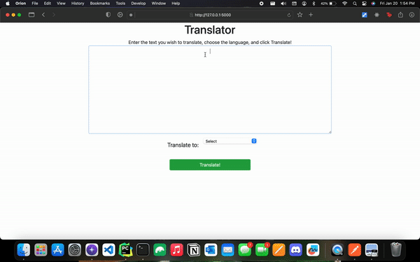

<h1 align="center">Translator</h1>

    Web application that translates the user's inputted text to over 70 languages. This application is build with 
    Flask and Microsoft Azure Services. 

<figure style="text-align: center">
    
    <figcaption>
        The user's experience when the using the app is showed above.
    </figcaption>
</figure>

<h2 align="center">Text to Speech</h2>

    Once the user's input is translated they are giving the option to have the 
    translated text read to them. The user can choose between a male or female voice. Since a language can be spoken 
    in more than one region of the world, there is an option to select which region the voice is from.

<figure style="text-align: center">
    <figcaption>
        The user's experience when the using the app is showed above.
    </figcaption>
</figure>

